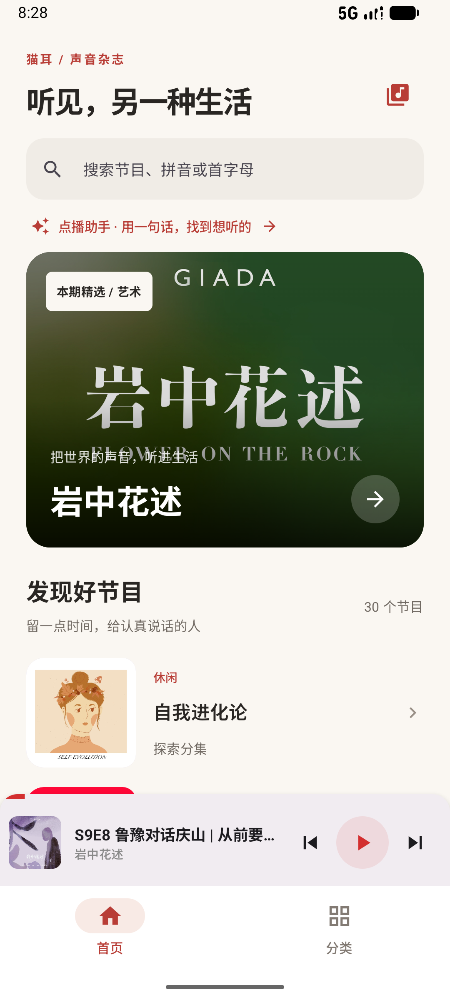
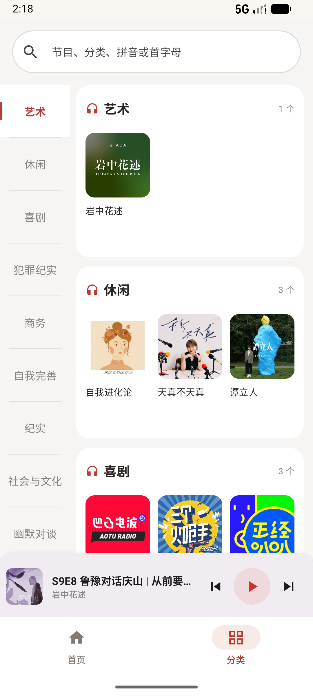
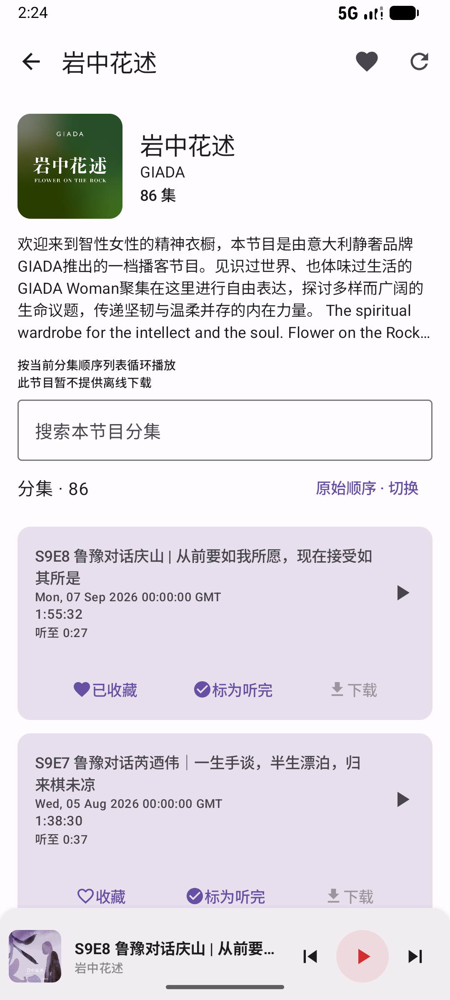
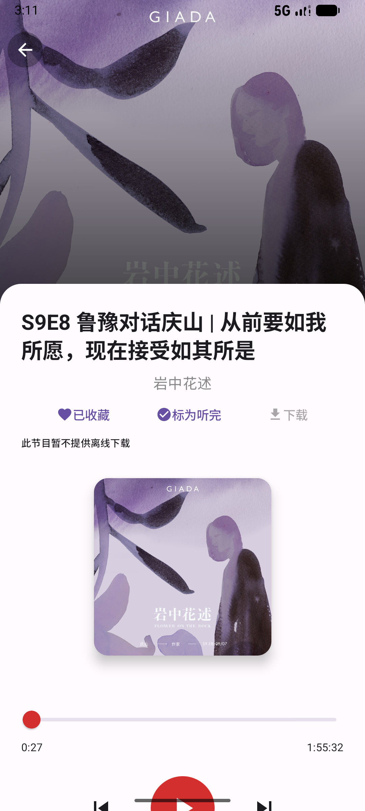
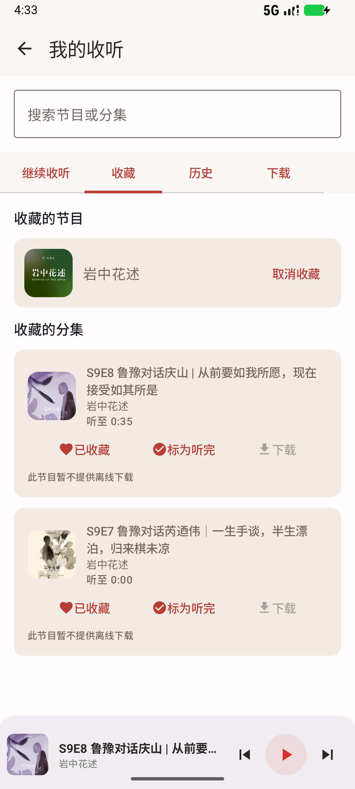
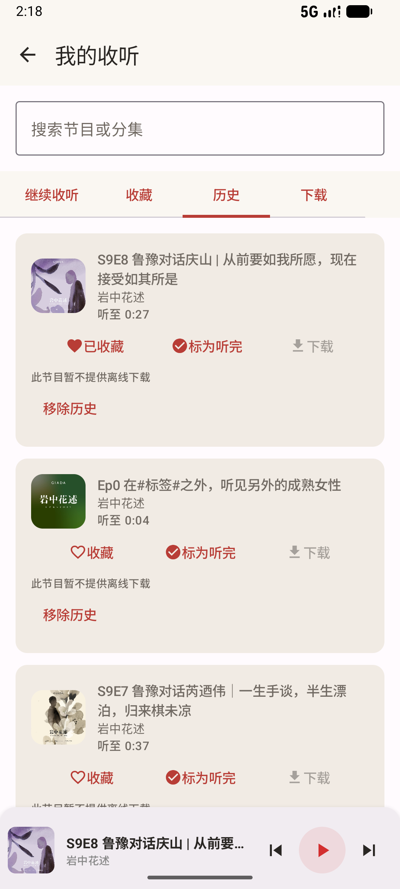
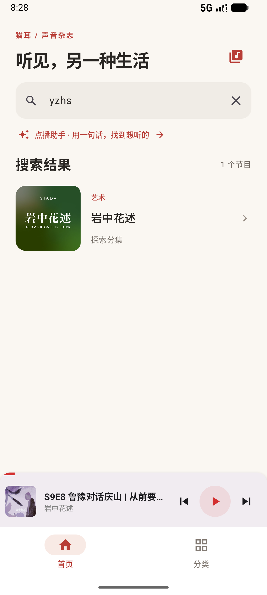
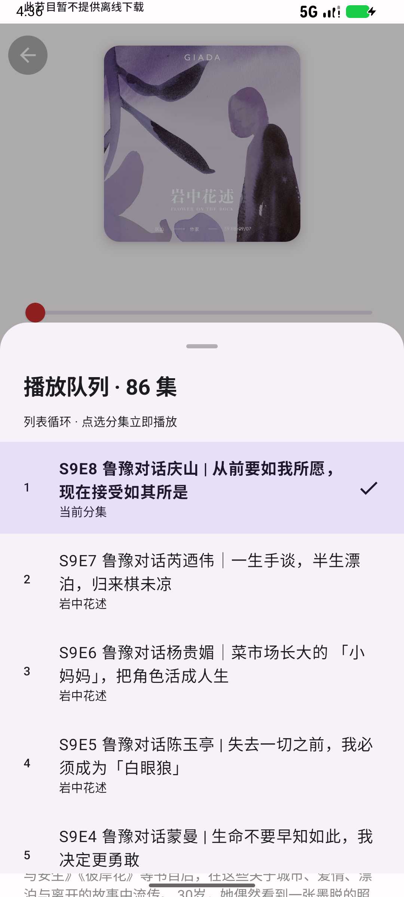
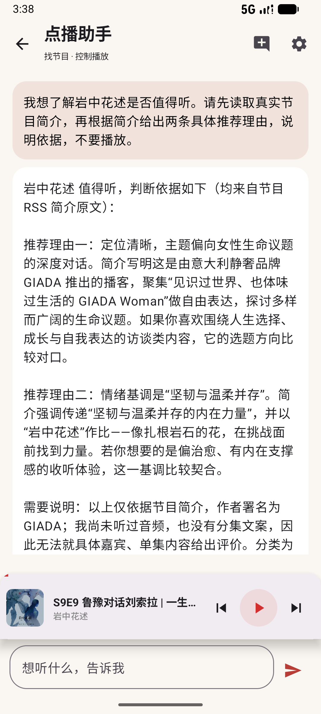

# MaoerLite · 猫耳

**听见，另一种生活。**

MaoerLite 是一款以公开 RSS 为内容入口的 Android 播客点播器。使用 Compose Multiplatform 构建界面、Kotlin Multiplatform 组织业务逻辑，提供杂志风首页、分类浏览、中文与拼音搜索，以及可保存收听进度的播放器。新增文字 AI 助手通过本机或内网 Python 服务理解请求，由手机查询真实目录、RSS 并执行播放操作。

当前版本：**1.1.0-dev**（versionCode 2）。内置目录包含 **30 个节目、19 个分类**，节目分集从真实 RSS 加载。本阶段交付 Android；iOS 保留工程入口及接口存根，尚未完成播放能力。

## 页面预览

以下 9 张截图于 2026-09-21 从当前开发版本的 Android API 36 模拟器采集。节目封面与标题来自对应内容源，分集数量和内容会随 RSS 更新。助手截图展示真实页面，不作为真实模型闭环通过的证据。

| 杂志风首页 | 分类浏览 |
| --- | --- |
|  |  |
| 大封面精选与节目列表；首页不放分类标签。 | 左侧选择分类，右侧浏览节目；底部仅保留首页、分类两个入口。 |

| 节目与分集 | 大封面播放页 |
| --- | --- |
|  |  |
| 查看节目介绍和完整分集列表，保留每集的收听位置。 | 保留大封面布局；向下滚动可查看完整控制区和分集简介。 |

| 我的收藏 | 收听历史 |
| --- | --- |
|  |  |
| 节目和分集分别收藏，从首页右上角进入“我的收听”。 | 按分集保存收听记录，可续听或移除记录。 |

| 拼音搜索 | 完整播放队列 |
| --- | --- |
|  |  |
| 输入 `yzhs` 即可找到“岩中花述”，无需切换中文输入法。 | 队列保留全部分集，上一集、下一集支持首尾循环。 |

| 文字 AI 助手 |
| --- |
|  |
| 从首页进入二级聊天页，保留首页、分类两个主入口；支持停止、恢复连接及重试当前步骤。 |

## 功能说明

### 发现与分类

- **首页**：暖色背景、红色点缀、大封面精选和节目列表；支持直接搜索节目。
- **分类**：左侧分类目录与右侧分组节目网格联动，支持分类内浏览和搜索。
- **导航**：只有“首页”和“分类”两个主入口。迷你播放栏单独占位，放在导航上方，并预留系统手势区域。
- **RSS 内容**：加载节目介绍、封面和分集信息，支持缓存及失败提示。元数据缓存用于再次浏览，不代表音频已下载。 新打开节目页会先展示缓存再检查更新，右上角可手动刷新；助手查询分集也会请求 RSS。没有后台定时轮询或新集推送，30 个内置节目名单固定，分集更新无需升级 APK。
- **结果定位**：修改搜索条件后，结果从顶部展示；点击分类目录定位到对应分组。首页与分类页分别保留浏览位置。

### 中文与拼音搜索

首页和分类页使用同一套本地搜索索引。输入时匹配内置节目的名称、分类及对应拼音，不需要向服务器提交搜索词。

| 想找的内容 | 可以输入 |
| --- | --- |
| 岩中花述：中文 | `岩中花述`、`花述` |
| 岩中花述：全拼 | `yanzhonghuashu`、`yan zhong hua shu` |
| 岩中花述：首字母或部分拼音 | `yzhs`、`huashu` |
| 科技分类下的节目 | `科技`、`keji`、`kj` |

搜索忽略英文字母大小写，兼容全角字母、数字，并对空格及标点做归一化处理。多个用空格分开的关键词也可分别匹配节目名称和分类。清空搜索词后恢复目录列表。

拼音索引覆盖当前固定的 30 个节目与 19 个分类；它不是任意中文全文转拼音服务。“我的收听”也可按节目拼音查找相关记录；RSS 动态分集标题按原文匹配，不承诺任意分集标题都可用拼音检索。

### 播放与队列

- 基于 **AndroidX Media3** 播放网络音频，支持后台播放、媒体通知及系统媒体控制。
- 进度条使用实际播放位置与媒体时长，可拖动定位；不使用演示时长。
- 节目页按当前分集筛选和排序生成队列，未筛选时包含整个节目的分集，不受列表分批展示数量限制。未开启睡眠定时时，队列第一集点“上一集”进入最后一集，最后一集点“下一集”回到第一集。
- 支持 **0.75×～2.0×** 倍速；睡眠定时提供预设时长、自定义时长及本集播完停止。
- 点击迷你播放栏的标题或封面进入播放页；播放页可收藏、标记听完，并查看分集简介。
- 应用重启后恢复队列与收听信息，保持暂停，避免自动出声。

### 我的收听

点击首页右上角的资料库图标进入“我的收听”。这是二级页面，不增加第三个底部主入口。

| 页面 | 用途 |
| --- | --- |
| 继续收听 | 找回未听完的分集，从各自保存的位置继续 |
| 收藏 | 管理节目收藏、分集收藏 |
| 历史 | 查看逐集收听记录，支持移除记录 |
| 下载 | 查看本地下载任务与文件；当前内置节目尚未开放下载 |

进度以分集为单位保存：切换节目或分集不会用新位置覆盖上一集的位置。支持标记已听完，重新播放已完成的分集可从头开始。收藏、历史和进度保存在设备本地；当前没有账号登录、跨设备同步、用户订阅或自定义 RSS 导入。

### 下载能力与当前开放范围

Android 下载链路已接入系统 **DownloadManager**，实现任务状态展示、失败重试、取消、删除，以及已下载文件的本地播放。系统负责后台传输和网络条件调度。

**当前 30 个内置节目均未开放下载。** 来源核查中，两个声湃源已找到允许个人离线收听的附条件许可，但许可展示、来源链接、请求标识和缓存规则等接入条件尚待落实；其余 28 个源尚未确认具体适用的使用许可。技术链路验证通过不等于内容来源条件已全部满足。

### 文字 AI 助手

首页点击“AI 助手”进入“语音助手”，服务连接统一在右上角设置。支持文字输入、流式回复、真实节目与分集卡片、停止生成、断线恢复及失败后重试当前步骤。页面切换不会主动取消任务；进程重启后可从本地记录恢复。输入框、播放栏与系统键盘分别占位。

右上角“新对话”会先删除服务端上一会话的任务记录（含消息、工具结果）和全部 LangGraph 检查点/中间写入，收到确认后再清空当前本地聊天记录、生成新对话 ID。删除失败或断线时保留当前记录并显示“重试删除”，重启也会继续确认删除，不重新创建旧请求。任务未结束时新对话按钮禁用。目前只保存当前会话供恢复，没有可切换的历史会话列表。

服务端仅保留不含消息正文的已删除会话 ID 哈希，防止迟到的重试把旧会话重新创建出来。删除会话不撤销已发生的播放或定时操作。

| 可以怎么说 | 手机执行的能力 |
| --- | --- |
| 帮我找岩中花述 / 找几个科技节目 | 复用中文、全拼和首字母目录索引，返回真实节目卡片 |
| 播放岩中花述最新一期 | 查询 RSS、核对分集 ID 和发布日期后，调用现有播放器 |
| 现在播放的是什么？ | 读取实际播放分集、播放状态和定时状态 |
| 暂停 / 继续播放 | 调用现有播放控制，并返回实际状态 |
| 20 分钟后停止 / 本集播完停止 / 取消定时 | 复用现有睡眠定时规则 |

模型选择工具，Android 执行操作，服务端依据真实回执继续任务。工具只接受约定参数；播放地址从现有目录/RSS 获得。分集日期无法可靠解析时会标记“最新顺序未确认”，不把 RSS 第一项直接当作最新一期。播放操作保留完整节目队列，并区分已开始、正在加载与失败。

每个任务、工具调用都有独立 ID。手机在执行前写入标记，完成后保存回执；重复请求返回已有结果。若应用中断导致操作结果不确定，会回传当前状态及“不确定”，不会自动再播一遍。停止生成会阻止后续操作，已经开始的播放不会因此自动暂停。

**验收边界：** 2026-09-21 切换中转站提供的 `deepseek-v4-flash-0731` 后，真实模型＋Medium Phone 的完整工具往返通过：6 条用户指令、全部 7 个工具、8 次实际执行，最终回答均正常结束。播放实测保留 86 集队列。此前 GLM 阶段因超时/繁忙未通过的记录保留，不把一次通过等同于持续可用。暂不接下载、收听历史推荐、ASR 或 TTS。

## 技术组成

| 层次 | 实现 |
| --- | --- |
| 共享业务与界面 | Kotlin 2.0.0、Compose Multiplatform 1.6.11、Coroutines |
| 页面导航与依赖注入 | Voyager 1.0.0、Koin 3.5.6 |
| 网络与 RSS | Ktor 2.3.12、xmlutil 0.86.3 |
| 图片加载 | Coil 3.0.4 |
| Android 播放 | Media3 1.4.0、MediaLibraryService、MediaController |
| SSH 连接 | mwiede/JSch 2.28.6、主机指纹校验、Android Keystore AES-GCM |
| 本地保存 | DataStore 1.1.1、Okio 3.9.1、逐条 JSON 文件持久化 |
| Android 下载 | 系统 DownloadManager |
| Android Agent | Ktor SSE、协程/StateFlow、应用私有执行回执 |
| Python Agent 服务 | FastAPI、HTTPX、LangGraph 1.2.11、SQLite 检查点 |
| Agent 基础组件 | langchain-core 1.6.3；未引入完整 LangChain Agent |
| 构建 | Gradle Wrapper 8.14.3、Android Gradle Plugin 8.5.2 |

共享层负责目录、RSS 解析、搜索、队列规则和收听资料；Android 层负责播放器、媒体服务与下载系统的接入。

```text
composeApp/src/
├── commonMain/kotlin/com/maoer/lite/
│   ├── data/podcast/       # 内置目录、RSS、缓存与拼音索引
│   ├── data/library/       # 收藏、历史、逐集进度与持久化
│   ├── data/manager/       # 播放状态、队列与定时规则
│   ├── data/download/      # 下载模型与接口
│   ├── data/agent/         # 任务通信、对话状态、业务工具、执行回执
│   ├── ui/                 # 首页、分类、节目、播放、资料库和 agent 聊天页
│   └── di/                 # 共享依赖配置
├── androidMain/
│   ├── AndroidManifest.xml # 应用入口、网络及前台播放权限、服务声明
│   ├── kotlin/com/maoer/lite/
│   │   ├── MainActivity.kt                   # Android Activity，承载共享 Compose 界面
│   │   ├── MaoerApplication.kt               # Application 初始化与 Koin 启动
│   │   ├── Platform.android.kt               # Android 平台信息实现
│   │   ├── data/
│   │   │   ├── agent/
│   │   │   │   └── AgentStorage.android.kt  # noBackupFilesDir 存储路径与发布日期解析
│   │   │   ├── manager/
│   │   │   │   └── AndroidMediaPlayerController.kt # 连接媒体服务、控制播放、同步状态
│   │   │   ├── download/
│   │   │   │   └── AndroidDownloads.kt       # 系统下载任务、状态恢复与本地文件
│   │   │   └── local/
│   │   │       └── DataStoreConfig.android.kt # 应用私有目录中的 DataStore 路径
│   │   ├── service/
│   │   │   ├── MaoerPlaybackService.kt       # ExoPlayer、媒体会话、后台播放与进度保存
│   │   │   └── PlaybackCommands.kt           # 睡眠定时命令与会话状态字段
│   │   └── di/
│   │       └── PlatformModule.android.kt    # 注入 Android 播放器和下载实现
│   └── res/                                 # Android 启动图标、应用名称等资源
└── iosMain/                # iOS 工程入口与平台接口存根
gradle/libs.versions.toml   # 依赖版本
iosApp/                    # iOS 宿主工程
agent-server/              # Python 模型网关、LangGraph 任务流程与检查点
```

### Android 层如何协作

| 组件 | 具体职责 |
| --- | --- |
| `MainActivity` / `MaoerApplication` | 启动 Android 应用，初始化依赖注入，并把共享 Compose 页面挂载到 Activity。 |
| `AndroidMediaPlayerController` | 实现共享层的播放器接口，通过 MediaController 连接后台服务；发送播放、暂停、定位、倍速和定时命令，将播放状态与实际进度反馈给界面。 |
| `MaoerPlaybackService` | 继承 MediaLibraryService，持有 ExoPlayer 和媒体会话；处理后台播放、系统媒体控制、队列切换和睡眠定时，并保存收听进度及播放快照。 |
| `PlaybackCommands` | 统一控制器与服务之间的自定义命令和字段，包括定时分钟数、剩余时间及本集结束停止状态。 |
| `AndroidDownloads` | 把共享下载接口接到系统 DownloadManager，管理任务入队、状态查询、重试、取消、删除及任务恢复，并提供可播放的本地文件。 |
| `DataStoreConfig.android` | 提供应用私有 `filesDir` 下的 DataStore 文件路径。收藏、历史等逐条 JSON 持久化逻辑位于共享层 `data/library`。 |
| `PlatformModule.android` | 通过 Koin 将共享的 `MediaPlayerController`、`Downloads` 接口绑定到 Android 实现。 |

播放命令从共享页面经过 `PlayerManager` 和 `AndroidMediaPlayerController` 到达后台媒体服务，播放状态再回传到界面。下载传输由系统 DownloadManager 执行，下载模块提供状态和文件供资料库、播放器使用。

## 构建与运行

### 环境准备

| 项目 | 要求或当前配置 |
| --- | --- |
| JDK | 17 或以上；本地验证使用 JDK 21 |
| Android SDK | 安装 Platform 34 和 Build Tools；AGP 默认需要 Build Tools 34.0.0 |
| Android 版本 | 最低 Android 7.0 / API 24，compileSdk 与 targetSdk 均为 34 |
| 运行设备 | Android 真机或模拟器；本地功能验收设备为 API 36 模拟器 |
| Gradle | 使用仓库自带 Wrapper；首次构建需下载依赖 |

在仓库根目录创建本机 `local.properties`，填写 SDK 路径，例如：

```properties
sdk.dir=G:/AndroidSDK
```

现有 `gradle.properties` 中设置了本机 JDK 路径。其他机器需要改为实际路径，或在命令行用 `-Dorg.gradle.java.home=...` 覆盖；不要直接沿用不存在的目录。

### 生成 Debug APK

在仓库根目录运行：

```powershell
.\gradlew.bat :composeApp:assembleDebug
```

如需覆盖 JDK 路径：

```powershell
.\gradlew.bat '-Dorg.gradle.java.home=C:/Program Files/Java/jdk-21' :composeApp:assembleDebug
```

macOS / Linux 对应命令为 `./gradlew :composeApp:assembleDebug`。

生成的安装包位于：

```text
composeApp/build/outputs/apk/debug/composeApp-debug.apk
```

连接已开启 USB 调试的设备，或先启动 Android 模拟器，再安装：

```powershell
.\gradlew.bat :composeApp:installDebug
```

应用包名为 `com.maoer.lite`。运行时需要联网加载未缓存的 RSS、封面与音频。业务构建不依赖本地维护工具或验收脚本。

## Agent 服务端（Python）

`agent-server/` 使用 FastAPI、Uvicorn 和 HTTPX，通过用户配置的 OpenAI 兼容中转站调用 `deepseek-v4-flash-0731`，在模型网关上运行 LangGraph 任务流程。模型节点生成回复或工具调用，设备节点中断等待 Android 回执，收到结果后从 SQLite 检查点继续。langchain-core 用于运行上下文和基础协议，未引入完整 LangChain Agent。

默认监听 `127.0.0.1:8787`，用于本机开发；通过 `AGENT_HOST` 可改为服务器实际持有的私网 IPv4 地址，`AGENT_PORT` 指定端口。当前仅接受回环和 RFC1918 私网监听地址。上游 Base URL、模型和 Key 从本机配置加载，客户端不能覆盖已配置模型，不会自动切换供应商或其他模型。当前中转站为 `https://www.dafangyuntu.com/ai/v1`；费用和额度由中转站账户决定，不沿用此前智谱免费模型的承诺。

### 初始化与启动

本地验证使用 Windows Python 3.10.11，虚拟环境位于 `.local/agent-venv`，无需 Conda 或手动激活。项目根目录执行：

```powershell
python -m venv .local/agent-venv
.\.local\agent-venv\Scripts\python.exe -m pip install -r agent-server/requirements.txt
```

创建 `.local/agent.env`，使用编辑器在本机填写，不把真实密钥发送到聊天或写进命令历史：

```dotenv
AGENT_PROVIDER=openai_compatible
AGENT_BASE_URL=https://www.dafangyuntu.com/ai/v1
AGENT_MODEL=deepseek-v4-flash-0731
AGENT_API_KEY=你的中转站密钥
```

启动服务端：

```powershell
.\agent-server\start.ps1
```

也可以后台启动或停止：

```powershell
.\agent-server\start.ps1 -Background
.\agent-server\start.ps1 -Stop
```

后台启动与停止命令分别使用，不能连续执行来保持服务运行。前台运行时用 Ctrl+C 停止。健康检查：`http://127.0.0.1:8787/healthz`；此接口只说明进程正常，不代表上游模型账户当前可用。

首次启动自动创建 `.local/agent-server.token`，它是本地接口访问令牌，与中转站 API Key 不同。配置、令牌、虚拟环境和运行日志均位于 Git 忽略的 `.local/` 中。服务端不会把上游 Key 返回给客户端或打印到日志。旧智谱项在本机注释保留；中转站模式只读取 AGENT_API_KEY，缺失时不会回退使用智谱 Key，也不会发送智谱专用 thinking 参数。

### 连接 Android

安装当前 Debug APK，保持电脑服务运行，对目标设备建立反向端口转发：

```powershell
adb -s emulator-5554 reverse tcp:8787 tcp:8787
```

真机使用对应的设备序列号。随后在首页进入“AI 助手”，打开右上角连接设置，把本机 `.local/agent-server.token` 中的**本地访问令牌**填入并保存。本机调试的地址填 `http://127.0.0.1:8787`；重新启动设备或 ADB 后可能需要重新建立端口转发。内网部署则填写服务器的完整地址，手机需要连入可达的同一内网或 VPN，端口放行后不需要 ADB。手机不填写上游 API Key；更换服务端模型也不必更换本地令牌。

若已填写正确令牌却提示无法连接，先确认电脑服务正在运行，再执行 `adb -s emulator-5554 reverse --list`。列表中应有 `tcp:8787 tcp:8787`；若没有，重新执行上面的转发命令，然后在助手中点击“恢复连接”。页面按钮恢复的是原任务，无法自行重建电脑端 ADB 转发。恢复后若显示“模型当前繁忙”，则连接已到达服务端，但上游模型暂不可用。

手机把连接配置、最近 30 条任务记录和执行回执保存到应用私有 `noBackupFilesDir/agent`，不写进 APK。Android 连接配置（含 SSH 密码与访问令牌）使用 Android Keystore 的 AES-GCM 密钥加密；旧版明文连接文件在读取成功后自动迁移，不能解密时不会静默回退到明文。服务端的任务快照保存于 `.local/agent-tasks.sqlite3`，LangGraph 检查点保存于独立的 `.checkpoints` 数据库；恢复任务时需要保留这两个文件。运行时关闭 LangSmith tracing，不默认上传整份收听历史。

### Linux 用户目录部署（内网 / VPN）

已在 Ubuntu 22.04、现有 Conda `py310`（Python 3.10.19）上安装并启动。复制 `agent-server/` 到用户目录的项目目录，例如 `~/maoer-agent/agent-server`。复用现有 Conda Python，将依赖放入项目目录，不升级其他项目使用的环境包：

```bash
cd ~/maoer-agent
umask 077
mkdir -p .local/packages .local/tmp .local/pip-cache
TMPDIR="$PWD/.local/tmp" PIP_CACHE_DIR="$PWD/.local/pip-cache" \
  PYTHONDONTWRITEBYTECODE=1 "$HOME/miniconda3/envs/py310/bin/python" -m pip install \
  --target "$PWD/.local/packages" -r agent-server/requirements.txt --only-binary=:all:
```

在此目录创建 `.local/agent.env`，使用上面的模型配置，另加监听地址和端口。App 内 SSH 模式推荐只监听服务器自身回环地址：

```dotenv
AGENT_HOST=127.0.0.1
AGENT_PORT=8787
```

这里的 127.0.0.1 指远端服务器自身，由 SSH 服务转发访问；如果使用直接连接模式，则换成服务器实际私网 IP 并由管理员放行业务端口。启动命令不需要 sudo；代码、配置、依赖、数据库和日志均放在用户目录中：

```bash
bash agent-server/start.sh start
bash agent-server/start.sh status
# 需要停止时执行：bash agent-server/start.sh stop
```

默认复用 `$HOME/miniconda3/envs/py310/bin/python`；路径不同可通过环境变量 `AGENT_PYTHON` 指定已有解释器。脚本通过 `nohup` 后台运行，日志写入 `.local/agent-server.log`，进程锁避免重复启动；未安装系统服务，不提供服务器重启后的自动启动或崩溃拉起。完整依赖和凭据需要先准备好，启动输出后还应检查 `/healthz` 与实际 Agent 请求。

迁移已有会话时先停止原服务，再一致地复制 `.local/agent-tasks.sqlite3`、`.local/agent-tasks.sqlite3.checkpoints` 和 `.local/agent-server.token`；模型配置仅复制当前使用的供应商。原实例保持停止，避免新旧服务各自处理同一任务。Android 会保留已保存的地址，需要在连接设置中手动切换；未完成任务时禁止切换服务器，但允许修正同一服务器的令牌并恢复。

当前内网方案使用 HTTP 和访问令牌，HTTP 本身不加密，仅面向可信内网或受保护的 VPN。客户端拒绝公网 HTTP 地址；公网部署还需要 HTTPS 入口和独立的账号/授权设计。当前共享令牌适用于个人项目验证，不是多用户服务。

**本轮远端验收：** 初始电脑隧道阶段验证了迁移和连接配置；之后关闭电脑 SSH 隧道并移除全部 ADB 8787 转发，Medium Phone 通过 App 内隧道独立完成中文播放、20分钟定时和暂停。错误主机指纹、错误密码、加密配置篡改均被拒绝；同任务断线恢复、任务结束关闭隧道、杀进程释放连接及重启后重新连接通过。服务器进程在手机退出前后保持运行，其他 SSH 连接未受此次测试影响。真机尚未实测，具体手机/VPN能否路由到服务器22端口仍取决于网络条件。当前Agent预览采自实际对话记录；历史定时文字不是实时状态，进程重启不恢复定时。

**网络边界：** 部署初期，业务端口直连和受控候选端口验证超时，已测端口中仅 SSH 22 可达。后续增加 App 内 SSH 隧道，服务器改为仅监听自身 127.0.0.1:8787，手机只需能访问服务器 SSH 端口，无需放行 8787。仍需内网或具有该服务器访问权限的 VPN；这不使私网 IP 自动变成公网地址。

### 手机独立使用 SSH 隧道

在助手右上角连接设置选择“SSH 隧道”，填写：

| 配置项 | 含义 |
| --- | --- |
| SSH 服务器与端口 | 手机可达的服务器 IP/域名与 SSH 端口，通常为 22 |
| SSH 用户名、密码 | 服务器允许的密码登录账号，仅加密保存在手机私有目录 |
| 服务器指纹 | 读取后与服务器提供的 SHA256 指纹核对，明确确认后保存 |
| 服务器内服务地址 | 默认 `http://127.0.0.1:8787`，此处回环地址属于远端服务器 |
| 服务访问令牌 | 远端 `.local/agent-server.token`，不是 SSH 密码，也不是模型 Key |

本机临时转发使用手机回环地址和动态空闲端口，不向手机所在网络开放监听。主机身份严格校验；指纹变化会拒绝连接，不自动接受新主机。Android 使用 ECDSA 或 RSA SHA-2 主机算法，可在服务器查询 ECDSA 指纹：

```bash
ssh-keygen -E sha256 -lf /etc/ssh/ssh_host_ecdsa_key.pub
```

SSH 由 Android 平台的 [mwiede/JSch](https://github.com/mwiede/jsch) 实现，锁定 2.28.6；凭据加密使用 [Android Keystore](https://developer.android.com/privacy-and-security/keystore)。当前提供密码认证，不提供 App 内终端、远程命令或文件管理。

连接按任务创建和释放：同一任务的请求、SSE 与工具回执复用一个隧道，任务完成、失败或取消处理结束后主动关闭。切换页面不会打断正在执行的任务；杀掉进程后系统关闭连接，服务器 Agent 服务继续运行。网络中断后点击“恢复连接”会重建隧道，从同一任务恢复；不会自动重新发送整条聊天或重做已记录工具。没有额外常驻 SSH 前台服务，也不保证系统杀进程后继续在手机执行工具。

首次配置完成后，真机在同一可达内网或 VPN 中即可独立使用，不需要电脑、USB 或 ADB；仅安装 APK 不会自动获得服务器凭据。服务器服务必须保持运行且允许该账号进行本地端口转发。服务端进程退出、机器关机或 VPN 不通时，SSH 本身不能代替这些条件。

### 在电脑上聊天

服务运行时，另开终端：

```powershell
.\.local\agent-venv\Scripts\python.exe -B agent-server/chat.py
```

输入中文即可流式交流；`/clear` 清空当前对话，`/exit` 退出。该终端客户端没有连接真实播客业务，不会播放音频或修改收听记录。它只读取本地访问令牌，不读取上游 Key。

### 接口和代码结构

| 文件/接口 | 职责 |
| --- | --- |
| `agent-server/config.py` | 加载供应商、Base URL、模型与对应 Key，生成独立访问令牌 |
| `agent-server/protocol.py` | 校验文字消息、函数定义、工具调用和结果配对，过滤推理字段 |
| `agent-server/app.py` | FastAPI 网关、HTTPX 连接、SSE 转发、取消、超时和限流 |
| `agent-server/rate_limit.py` | 上游 429 分类、官方等待时间解析、共享冷却与递增退避 |
| `agent-server/agent_model.py` | Agent 模型流式适配、完整工具参数组装、复用网关并发与冷却策略 |
| `agent-server/agent_tools.py` | 固定工具清单、参数约束和任务提示 |
| `agent-server/agent_tasks.py` | LangGraph 模型/设备节点、中断恢复、SQLite 快照、回执幂等及取消 |
| `agent-server/agent_routes.py` | 任务创建、查询、SSE、工具领取/回传、取消及检查点重试 |
| `agent-server/main.py` | 按配置启动本机或私网 Uvicorn 服务 |
| `agent-server/chat.py` | 供本地使用的文字聊天客户端 |
| `agent-server/start.ps1` | Windows 前台运行、后台启动及停止 |
| `agent-server/start.sh` | Linux 用户目录后台启动、进程锁、状态查询及停止 |
| `agent-server/requirements.txt` | 本轮验证使用的 Python 依赖锁定 |
| `GET /healthz` | 无需认证的本机健康检查 |
| `POST /v1/chat/completions` | 使用本地令牌的 Bearer 认证，接受 messages、stream 和可选 function 工具定义 |
| `POST /v1/agent/runs` | 使用客户端任务 ID 创建任务；相同 ID 和内容重复提交不会新建任务 |
| `GET /v1/agent/runs/{id}`、`GET /v1/agent/runs/{id}/events` | 查询当前状态或订阅 SSE 状态/文字快照 |
| `POST /v1/agent/runs/{id}/claim/{call_id}`、`POST /v1/agent/runs/{id}/results` | 领取待执行工具并回传真实执行结果 |
| `POST /v1/agent/runs/{id}/cancel`、`POST /v1/agent/runs/{id}/retry` | 停止后续派发，或从失败步骤的检查点重试 |
| `DELETE /v1/agent/conversations/{id}` | 鉴权、幂等删除已结束会话的任务及检查点；未结束时返回 409，删除失败可重试 |

原始聊天网关限制：请求体最多 64 KiB、40 条消息、8 个函数工具、2048 个输出 Token。Agent 任务额外限制单条用户输入 2000 字符、每次输出 1024 Token、每轮一个工具、每条任务最多 5 轮成功模型调用；后续对话保留上一条完整任务的上下文。所有模型路径共享单进程一个并发、每分钟最多 6 次和 90 秒调用总时限。服务端不执行任意函数。消息和请求头不写入运行日志；本地任务数据库会保存恢复所需的对话和工具结果。

原始聊天网关使用 SSE 的 `data: [DONE]` 表示正常结束、`event: error` 表示中断。Agent SSE 则发送带版本号的完整任务快照，以任务状态判断等待工具或结束；重连不会把已收到的文本重复追加。只有完整模型输出经过工具白名单、参数和来源 ID 验证后，才交由手机执行。模型服务尚未部署到公网，没有账号、多设备协同、持久化配额或生产级运维配置。

429 按供应商解释。当前中转站模式识别 `rate_limit_exceeded`、`overloaded_error`、`server_overloaded` 等暂时性拒绝；`insufficient_quota`、`billing_hard_limit_reached` 等额度错误不自动重试。未知 429 不盲目重试。智谱数值错误码只在显式启用 zhipu 模式时使用，避免把中转站错误误判成智谱账号问题；不会转发上游错误正文。

网关按连续 429 次数设置 30、60、120、300 秒冷却，并附加 0–5 秒随机等待。合法上游 `Retry-After` 是等待下限；冷却期间不访问上游，完整成功后重置。状态保存在当前服务进程中，重启会清空。仍保留本地单并发、每分钟 6 次模型调用限制，多步工具任务可能短暂显示等待状态。

重试只有一层：电脑聊天由终端负责，Android Agent 由服务端模型节点负责，Android 不自动重发模型请求。每条终端消息或每次 Agent 模型节点执行最多 3 次尝试，累计自动等待最多 120 秒，180 秒窗口内才发起重试。等待超过预算时停止，不缩短上游等待要求。流中断、超时和网络错误不自动重放；用户可停止等待，失败后从当前步骤的检查点重试。

历史验证：智谱阶段曾通过真实模型＋合成工具结果的往返，以及 18 项限流专项，但实际 GLM＋Android 完整闭环受超时/平台繁忙阻断，未通过。该失败记录保留；本次中转站的结果单独记录，不把历史合成数据测试当作手机执行成功。

## 当前验证状态

**2026-09-21 Agent 接入验证：**

| 项目 | 结果与边界 |
| --- | --- |
| 构建与既有单元测试 | Debug 构建通过；39 项 JVM 测试中 38 项通过、1 项因可选 RSS 快照缺失跳过 |
| 服务端任务与模型适配（接入阶段） | 16 项隔离测试通过，覆盖鉴权、参数、真实 LangGraph/SQLite 中断恢复、幂等、取消、检查点重试、流式组装及错误处理 |
| Android 实际业务 | 确定性模型驱动：拼音搜索、真实 RSS、实际 Media3 播放、完整 86 集队列、暂停、定时及取消通过 |
| 重复与恢复 | 重复回执不会重置定时；中断操作返回稳定的 unknown 回执；取消尚未创建的任务可恢复 |
| 新建对话删除旧会话 | 6 项服务端删除专项通过；Medium Phone 实测断线保留、重启后续删及两库记录清空，删除不调用模型 |
| 中转站配置与协议 | 6 项迁移隔离测试通过：Key 分离、配置模型锁定、请求地址、参数兼容、流式工具组装及供应商限流分类 |
| 真实中转站模型与 Android | **通过**：6 条指令均 completed；7 个工具共执行 8 次，覆盖搜索、RSS、实际播放、暂停、继续、定时与状态查询 |
| 收尾服务端回归（2026-09-21） | 22 项隔离测试通过，覆盖请求边界、工具参数、取消、重复结果、检查点恢复、删除、重试及轮次上限；修复请求解析和最终检查点恢复问题，正式服务已加载 |
| 历史 GLM 与 Android | **未通过**：智谱阶段受超时/平台繁忙阻断，已切换中转站，历史失败保留 |

收尾回归已完成本轮可测范围：JVM 38 项通过、1 项可选 RSS 快照测试跳过；服务端 22 项隔离测试通过。修复已加载到正式服务，最新 APK 已安装到 Medium Phone。设备实测通过真实目录/RSS、资料库持久化、86 集首尾循环、定位/倍速、后台定时自然到期、Agent 实时状态查询、重复工具/回执、取消、同任务断线恢复及旧会话删除。状态说明已区分当前选中分集与实际播放，并要求当前状态问题重新查询；本轮真实模型复测一致，生成文字仍以工具结果为准。

页面的拼音输入、清空复位、分类切换和助手中文输入/设置通过 Android 无障碍动作验证。本轮模拟器的 ADB 键盘注入及软键盘显示异常在系统设置搜索框也复现，重启输入法未恢复，因此键盘专项未通过，具体环境根因待定位；原设置已恢复。跨日、真机蓝牙及完整 TalkBack 专项未测。

以下保留 **2026-09-19 原有 Android 功能**的本地验收记录。本轮重新采集页面截图，但未重跑全部来源播放和下载自动调度专项：

| 项目 | 结果与边界 |
| --- | --- |
| 构建 | Android Debug APK 构建通过 |
| 单元与内容检查 | 39 项 JVM 测试通过，覆盖真实 RSS 等业务逻辑；6 项内容审计测试通过 |
| 页面与搜索 | API 36 验证首页、分类、中文/拼音检索、滚动复位与 1.3 倍字体布局 |
| 播放 | 30 个节目各抽取一集，实际解码、播放与定位通过 |
| 队列 | 岩中花述完整 86 集，首集向前到第 86 集、末集向后回到第 1 集通过 |
| 收听资料 | 收藏、独立分集进度、历史、完成状态、重听和重启恢复通过 |
| 下载自动调度 | 条件通过：在 Android 真实判定联网有效的网络上自然调度，未强制运行任务；本地音频样本的失败、重试、完成、离线播放及清理链路通过 |
| 来源使用条件 | 尚未全部通过，当前下载开关全部关闭 |

默认模拟器网络中，Google HTTPS 联网探测不可达，可能导致下载任务等待网络。验证时临时换用可达的真实探测端点，完成后恢复原设置；这不代表默认网络问题已修复，也不代表长音频、跨日后台运行或所有真机环境均已验证。

睡眠定时保存在后台媒体服务进程中：普通切后台会继续计时，强制停止应用或重启媒体服务后不恢复定时。

后续仍需完成来源接入条件、跨日稳定性与真机专项。iOS 播放、账号体系、跨设备同步及自定义 RSS 导入不在当前交付范围。

## 文档与维护约定

README 和本页引用的 9 张当前截图作为项目说明保留。开发过程中的 BUG 原因、修复方法与验证记录持续更新；新增维护文档、回归测试、内容核查资料及辅助工具按维护者要求不纳入业务提交。本轮一次性验收脚本和测试文件在保留证据摘要后清理。因此，上述测试数量描述本地实际执行结果，不能视为当前提交附带了完整验收套件。

更新界面后需同步截图和说明，清理失效链接及被替代的预览图。节目封面、标题、简介与音频属于各自的内容来源；本项目不把公开 RSS 可访问视为任意转载或离线分发授权。
