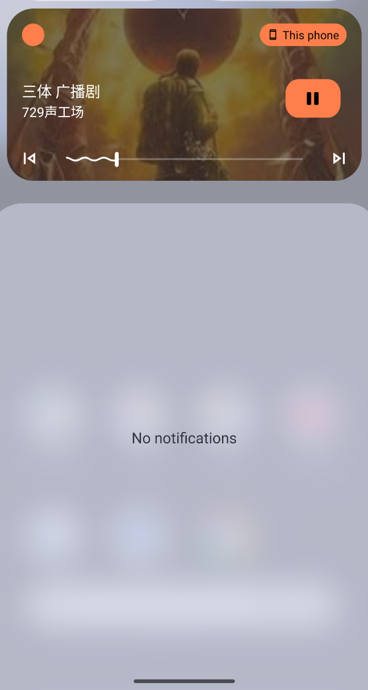

# 🎧 MaoerLite (猫耳Lite)

MaoerLite 是一个 Kotlin Multiplatform + Compose Multiplatform 的音频播放 Demo，重点演示：

- commonMain 共享 UI 与业务状态管理
- Android 端接入 Media3/ExoPlayer，实现后台播放、媒体通知/锁屏控制、音频焦点、耳机拔出自动暂停

本仓库当前以 Android 体验为主；iOS 端仍是存根实现（仅保证工程结构与编译链路）。

## 📸 App 截图

<div style="display: flex; justify-content: flex-start; gap: 10px; overflow-x: auto; padding-bottom: 20px;">
    
    
    
    
</div>


## 🛠️ 技术栈

- **Kotlin Multiplatform (KMP)**
- **Compose Multiplatform** (Material 3 UI)
- **Voyager** (多平台导航)
- **Koin** (依赖注入)
- **Ktor** (网络请求，目前使用 Mock 数据)
- **Coroutines / Flow** (异步与响应式编程)
- **AndroidX Media3** (ExoPlayer + MediaSessionService)

## ✅ 当前已实现（Android）

- **首页**：瀑布流列表展示音频推荐，底部常驻播放条。
- **详情页**：视差滚动背景，完整的播放控制（播放/暂停、上一首/下一首、进度拖拽）。
- **后台播放**：通过 `MediaLibraryService` 结合 ExoPlayer 实现，支持 App 切后台或锁屏后继续播放。
- **系统媒体控制**：集成 `DefaultMediaNotificationProvider`，在通知栏和锁屏界面显示媒体控制卡片。
- **音频焦点管理**：处理其他应用播放音频时的暂停/降低音量逻辑。
- **耳机插拔响应**：拔出耳机自动暂停播放。
- **播放队列管理**：支持列表循环播放，自动切歌。
- **状态持久化**：记录最后播放的音频 ID 和进度，重启 App 自动恢复。

## ℹ️ 行为说明

- **后台任务**：本项目设计为“从最近任务划掉 App 后仍然保持播放”，这符合大多数音频类 App 的预期行为。
- **权限**：Android 13+ 需要授予通知权限 (`POST_NOTIFICATIONS`) 才能显示媒体控制通知。

## 📂 代码结构

项目采用 **Kotlin Multiplatform** 标准结构，核心业务逻辑位于 `commonMain`，平台特定实现位于 `androidMain` / `iosMain`。

```text
composeApp
├── commonMain (跨平台共享核心：UI + 业务逻辑)
│   ├── kotlin/com/maoer/lite/
│   │   ├── App.kt                        # [入口] Koin 依赖注入初始化 + Voyager 导航根节点
│   │   ├── ui/
│   │   │   ├── home/HomeScreen.kt        # [UI] 首页：LazyVerticalStaggeredGrid (瀑布流) + BottomPlayerBar (底部播放条)
│   │   │   └── detail/DetailScreen.kt    # [UI] 详情页：实现视差滚动背景 (Parallax) + 沉浸式播放控制
│   │   ├── data/
│   │   │   ├── manager/
│   │   │   │   ├── PlayerManager.kt      # [核心状态机] 全局单例。维护当前播放曲目、播放列表、持久化恢复逻辑 (Restore)
│   │   │   │   └── MediaPlayerController.kt # [接口定义] 跨平台播放器契约 (play/pause/seek/isPlaying Flow)
│   │   │   ├── repository/MaoerRepository.kt # [数据源] 模拟 API 请求，包含内存缓存与 Mutex 锁
│   │   │   └── local/KeyValueStorage.kt  # [持久化] 基于 DataStore 的键值对存储 (保存 last_audio_id)
│   │   └── model/                        # 数据模型 (Audio 等)
│
├── androidMain (Android 平台特定实现：Media3 + Service)
│   ├── kotlin/com/maoer/lite/
│   │   ├── service/MaoerPlaybackService.kt # [Service] 核心后台服务 (MediaLibraryService)。持有 ExoPlayer，处理音频焦点、耳机插拔、通知栏
│   │   └── data/manager/
│   │       └── AndroidMediaPlayerController.kt # [连接器] 实现 Controller 接口。
│   │           ├── 通过 MediaController 连接 Service
│   │           ├── 内部轮询更新播放进度 (解决 Media3 无实时进度流问题)
│   │           └── 缓存异步指令 (Pending Commands) 以防止连接未就绪时的操作丢失
│   └── AndroidManifest.xml               # 注册 Service (`android:foregroundServiceType="mediaPlayback"`)
│
└── iosMain (iOS 平台存根)
    └── ... (目前仅包含基础架构，具体播放器实现待开发)
```

## 🚀 运行方式

### 💻 环境要求
- JDK 17+
- Android Studio Koala 或更高版本

### ⌨️ 命令
连接 Android 设备或模拟器后运行：

```bash
./gradlew :composeApp:installDebug
```

## ⚠️ 存在的问题

### 1. 播放器功能与状态管理
-   **iOS 端缺失**：目前的 `iosMain` 仅为存根，调用播放接口不会有任何反应（也不会崩溃，因为接口未对接），iOS 用户无法使用播放功能。
-   **进度更新机制**：`AndroidMediaPlayerController` 采用 **200ms 轮询 (Polling)** 的方式从 ExoPlayer 获取当前播放进度。虽然这在 Android 上是常规做法（因为 `onEvents` 频率不固定），但在低电量模式下可能带来轻微的性能损耗，且 UI 进度条可能会有细微的跳帧感。
-   **指令竞态风险**：由于 `MediaController` 连接 Service 是异步的，如果在连接建立前快速连续点击“播放/暂停”，依赖内部的 `pendingCommand` 缓存机制处理。虽然已做处理，但在极端高并发操作下仍可能存在状态不同步的边缘情况。
-   **错误处理缺失**：目前未监听 ExoPlayer 的 `PLAYER_ERROR` 状态。如果网络断开或音频资源 404，UI 层仍可能显示为“加载中”或无响应，缺乏用户提示。

### 2. 数据与持久化
-   **DataStore 写入频次**：虽然为了实现“重启恢复进度”，代码中对进度保存做了降频处理（5秒一次或暂停时保存），但 `DataStore` (Preferences) 本质是全量文件写入。在长时间后台播放场景下，频繁的磁盘 IO 可能影响性能。
-   **Mock 数据限制**：`MaoerRepository` 使用硬编码数据，音频时长 (`duration`) 是字符串格式供 UI 展示，与 ExoPlayer 解析的实际时长可能不完全一致，导致进度条计算在首帧可能不准确。

### 3. 系统集成
-   **MediaBrowser 支持**：`MaoerPlaybackService` 中的 `onGetLibraryRoot` 等方法返回了 `ERROR_NOT_SUPPORTED`。这意味着本应用虽然支持系统媒体通知，但**不支持** Android Auto (车载) 或其他媒体浏览客户端读取播放列表。
-   **后台保活**：虽然使用了前台服务 (`foregroundService`)，但在部分国产深度定制 ROM 上，仅靠标准 Media3 实现可能仍会被杀后台，未接入特定厂商的保活白名单逻辑。