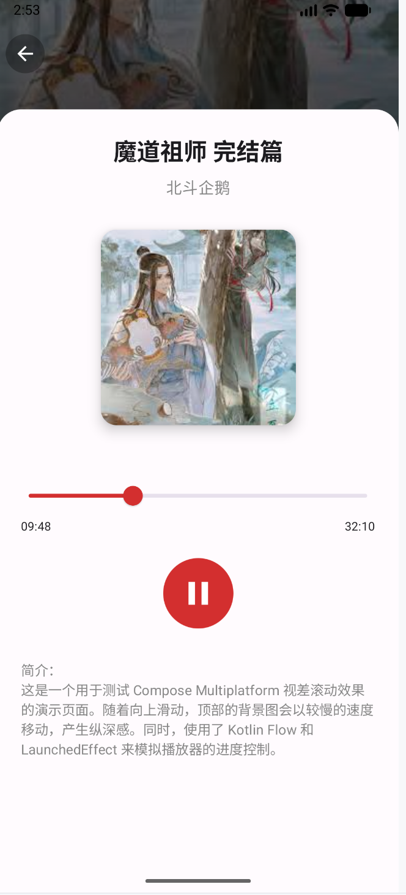

# 🐱 MaoerLite (猫耳Lite)


**MaoerLite** 是一个基于 **Kotlin Multiplatform (KMP)** 和 **Compose Multiplatform (CMP)** 技术栈构建的跨平台音频社区客户端原型（Demo）。

本项目旨在验证使用**一套代码**同时构建 Android 与 iOS 原生应用的可行性，并实践了现代化的移动端架构模式。

---

## 📸 运行截图 (Screenshots)

<div align="center">
  
  
  
</div>

> *注：截图展示了 Android/iOS 双端一致的 Material Design 3 风格 UI。*

---

## 🛠 技术栈 (Tech Stack)

本项目采用全栈 Kotlin 开发，使用了目前 KMP 生态中最主流的开源框架：

*   **核心语言**: [Kotlin 2.0](https://kotlinlang.org/) (K2 Compiler)
*   **UI 框架**: [Compose Multiplatform](https://www.jetbrains.com/lp/compose-multiplatform/) (Material Design 3)
*   **路由导航**: [Voyager](https://voyager.adriel.cafe/) (专为 KMP 设计的导航库)
*   **依赖注入**: [Koin](https://insert-koin.io/) (轻量级 Kotlin 原生注入框架)
*   **图片加载**: [Coil 3](https://coil-kt.github.io/coil/) (完全支持 KMP 的网络图片加载)
*   **网络请求**: [Ktor](https://ktor.io/) (异步 HTTP 客户端，已配置 JSON 序列化)
*   **异步编程**: Kotlin Coroutines & Flow (响应式数据流)
*   **架构模式**: Clean Architecture + MVI/MVVM (ScreenModel)

---

## ✨ 已实现功能 (Implemented Features)

*   **跨平台架构**: Android 和 iOS 共享 **95%+** 的业务逻辑与 UI 代码。
*   **首页瀑布流**: 
    *   使用 `LazyVerticalStaggeredGrid` 实现双列交错布局。
    *   基于 `StateFlow` 的数据驱动 UI，包含加载状态 (Loading) 管理。
*   **沉浸式详情页**:
    *   **视差滚动 (Parallax Scrolling)**: 背景封面随手指滑动产生视差位移效果，顶部导航栏根据 Z-Index 机制正确处理点击事件。
    *   **UI 交互**: 实现了播放器进度条拖拽逻辑。
    *   **模拟播放**: 使用协程 (`LaunchedEffect`) 模拟音频播放进度流转。
*   **工程化**:
    *   使用 `libs.versions.toml` (Version Catalog) 统一管理依赖。
    *   模块化分层设计 (Data / UI)。

---

## 🚧 待办事项 (To-Do)

*   [ ] 接入真实的音频流媒体服务 (ExoPlayer/AVPlayer)。
*   [ ] 详情页背景高斯模糊效果。
*   [ ] 真实的 API 接口对接 (目前使用 Mock 数据)。

---

## 🚀 快速开始 (Getting Started)

### 环境要求
*   JDK 17+
*   Android Studio Koala 或更高版本
*   Xcode 15+ (仅 iOS 开发需要)

### Android 运行
```bash
./gradlew :composeApp:installDebug
```

### iOS 运行
1.  使用 Xcode 打开 `iosApp/iosApp.xcworkspace`
2.  选择模拟器并点击 Run

---

## 📂 项目结构

```text
commonMain/kotlin/com/maoer/lite/
├── data/           # 数据层 (Repository, Models - Mock Data)
├── di/             # Koin 依赖注入模块 (AppModule)
├── ui/             # Compose UI 界面
│   ├── home/       # 首页 (StaggeredGrid + ViewModel)
│   ├── detail/     # 详情页 (Parallax Effect + Player State)
│   └── ...
├── App.kt          # 应用入口
└── Platform.kt     # 平台差异化接口
```

---

## 📝 说明

本项目为 **技术验证 Demo**，旨在展示 KMP 架构能力。
项目中展示的音频信息均为 Mock 数据，不包含真实版权内容。
